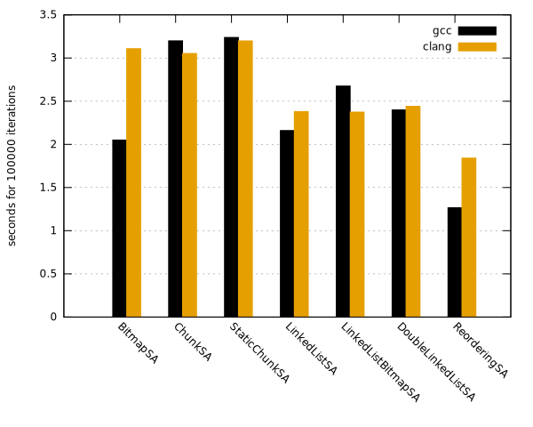
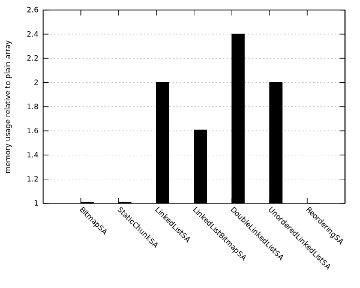

# Sparse Array Implementations

This repository contains C++ implementations of fixed-length arrays with holes. When iterating over
the array, the holes are skipped.

In addition to iteration, the arrays have two methods:

 - **New** returns a pointer to an unused element or `nullptr` if the array is full.
 - **Delete** takes a pointer to an element and disables it so that it is skipped during iteration.

To improve cache locality, iteration always happens in memory order and holes are filled
sequentially. However, this make the `New` and `Delete` operations more expensive (generally O(n)
instead of O(1) for an unsorted (double) linked-list implementation).

A data structure like this is used for OpenClonk's [PXS][1] which are “tiny bits of moving
material”. Iteration happens twice per frame for simulation and drawing. PXS are created mainly for
waterfalls and rain. Deletion usually happens when the PXS hit something and settle. Thus, there is
no predictable lifetime.

[1]: https://github.com/openclonk/openclonk/blob/master/src/landscape/C4PXS.h

## Implementations

The following describes all implementation variants which are located in `sparsearray.h`.

### BitmapSA

*BitmapSA* uses a bitmap of 64 bit integers as index into the array. Each bit corresponds to one
array element. This makes searching for both used and unused locations very efficient. A slice of 64
elements is empty if the corresponding bitmap integer is 0 and full if its complement is 0.

Additionally, processors generally have instructions (`bsf` or `tzcnt` in x86) for finding the first
set bit. GCC and clang include the `__builtin_ffsll` function which compiles to `tzcnt` on g++ 6.3.1
and to `bsf` on clang 3.9.1. MSVC has the intrinsic `_BitScanForward64` as well, but is not
supported (yet) by the code.

### ChunkSA and StaticChunkSA

*ChunkSA* is equivalent to the old C4PXS implementation in OpenClonk (and earlier). It uses a
dynamically allocated array of chunks to store array elements. For each chunk, it stores the count
of used elements. While this allows skipping full or empty chunks, the chunks have to be searched
element by element to find used or empty spots. The original implementation used a C4PXS data field
to identify unused elements. As the implementation here is more general, it uses an `std::bitset` to
store used/unused bits per element.

*StaticChunkSA* uses the same algorithms, but does not allocate chunks dynamically.

### LinkedListSA and variants

*LinkedListSA* holds two singly linked lists, one for all used elements and another for all unused
elements. This makes iteration and finding the next unused element very efficient. However, when
moving items between the lists, the implementation must maintain correct memory order. To find the
new previous list element, it searches the underlying array backwards for the next used or unused
element identified by a boolean field.

*LinkedListBitmapSA* holds a bitmap to identify used or unused elements instead of the boolean
field which uses a bit less memory.

*DoubleLinkedListBitmapSA* includes a back-pointer for each element to make removal from the *used*
list more efficient. However, it still has to search backwards for the previous element of the other
list. Two more pointers would be require to eliminate all searching which is unlikely to be more
efficient.

### UnorderedLinkedListSA

*UnorderedLinkedListSA* is there to verify the assumption that maintaining memory order is necessary
for good performance. Its `New` method is in O(1), but `Delete` has to traverse the list to update
the previous element's `next` pointer.

## Evaluation

The test program (in `main.cpp`) is a simplified PXS simulation. Each iteration adds up to ten PXS
with random velocities. The simulation removes PXS which travelled a maximum distance.

The Arch Linux test system has an Intel i7-6700 (Skylake) CPU running at 4.00 GHz.

### Performance

Figure 1 shows the complete benchmark results. It is immediately obvious that UnorderedLinkedListSA
is not competitive at all and that good cache locality is important.

Figure 2 only shows the faster implementations. An interesting result is that performance depends a
lot on the compiler. GCC produces the best results overall, but is slower for some of the
benchmarks.

*BitmapSA* has the largest difference between the two compilers. With GCC, it performs best overall,
but is among the slowest with Clang. The difference is most likely due to the choice in “find first
set” instructions. As mentioned above, GCC uses the `tzcnt` instruction while Clang uses `bsf`.
While only Haswell or newer CPUs support `tzcnt`, it decodes to `bsf` on older CPUs. A bit of
googling suggests that `tzcnt` is indeed faster than `bsf` on CPUs that support the newer
instruction, although I did not find any benchmarks.

*ChunkSA* and *StaticChunkSA* are the slowest implementations. Interestingly, *StaticChunkSA* is
actually a bit slower even though it does not do dynamic allocation. As the benchmark is constantly
adding elements to the array, *ChunkSA* does probably never free any chunks.

The *LinkedList* implementations are generally faster than *ChunkSA*. With Clang, all three variants
have roughly the same speed. On the other hand, GCC produces faster code for *LinkedListSA*, but
significantly slower code for *LinkedListBitmapSA*

### Memory Overhead

Figure 3 shows the memory overhead relative to a plain array of 10000 elements (200000 byte). It
does not include the dynamically allocating *ChunkSA*, however peak memory usage should be identical
to *StaticChunkSA*.

Both *BitmapSA* and *StaticChunkSA* are very memory-efficient and have less than 2000 byte overhead.
On the other hand, the *LinkedList* variants have to store pointers as well as “used” booleans for
each elements, resulting in a significant increase in memory usage.
